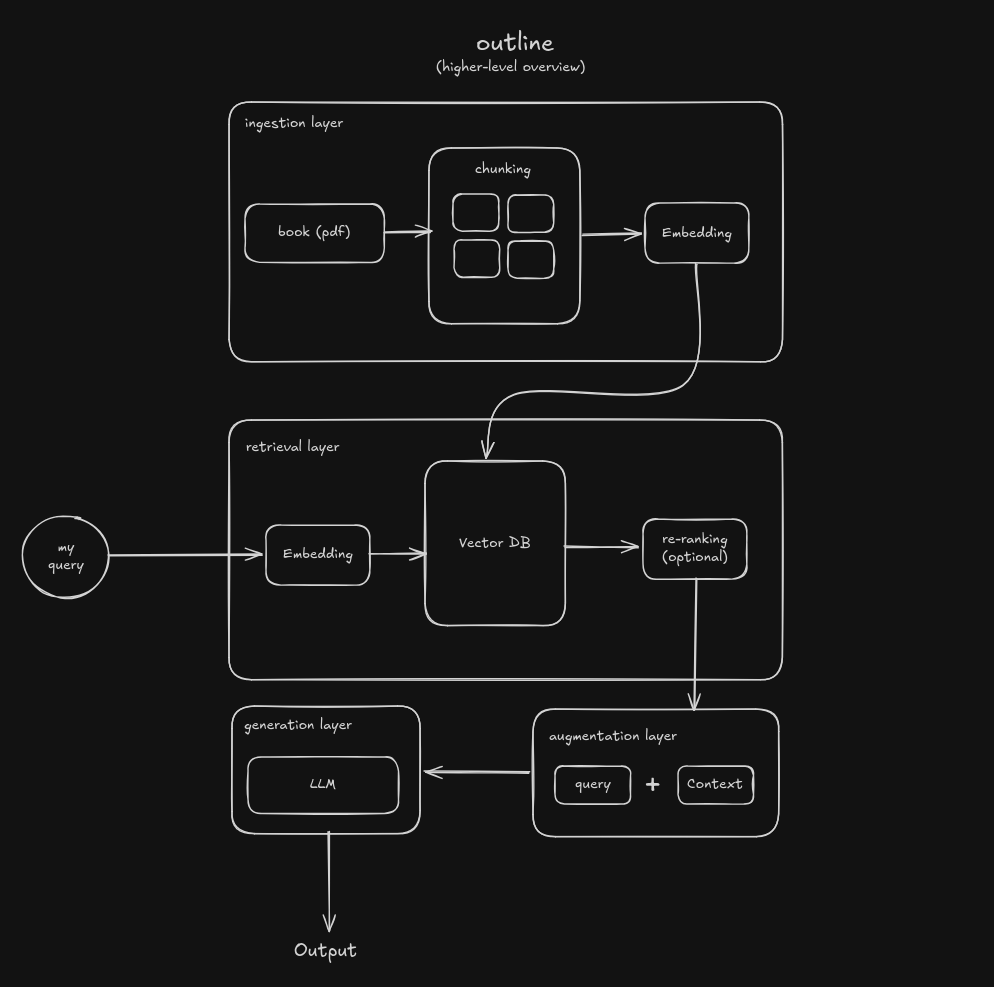

# outline
`Outline` is a personal tool for technical reading. Built to extract, navigate and understand core ideas of a given technical book.

# why am i building this?
One of the main reasons I'm building this is to:
- personalize my learning experience.
- develop practical experience working with LLM's, Vector DB's and RAG.

# high-level RAG architecture

